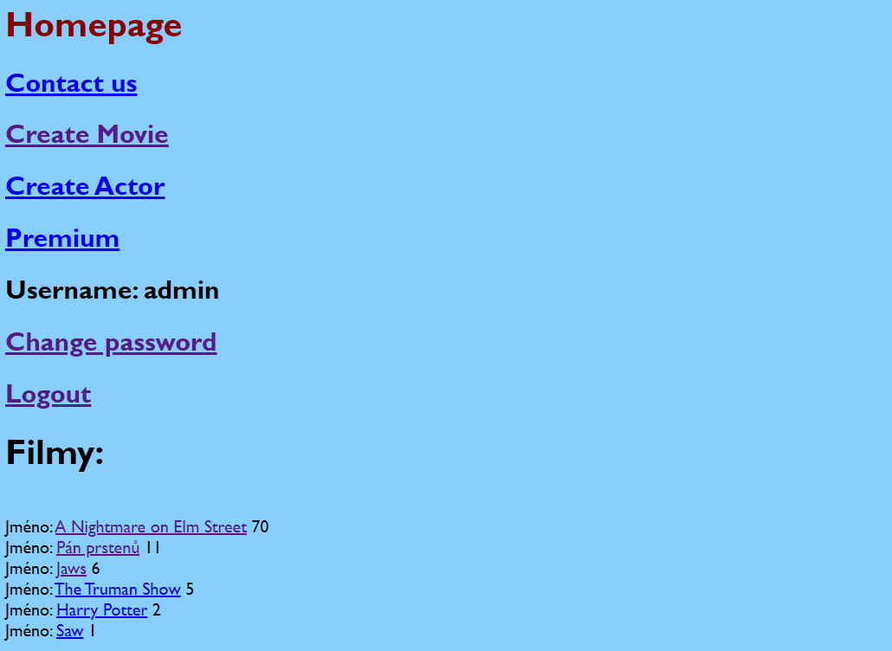

## HOLLYMOVIES APP

The very first web application, which was created while studying at the Software Development Academy. You can create movies, assign a genre and rate movies using the "Like" button. Movies can be edited or deleted.

## The app is built with:
* Python
* Django
* PostgreSQL
* HTML
* Git

# Printscreens of application

